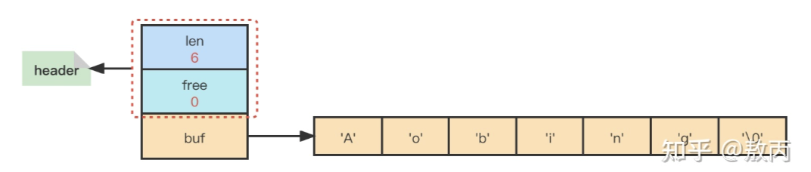

### 📌Chapter2-简单动态字符串
#### 🔻概要
        🔸Redis的字符串没有采用C标准库的 而是采用的自研的简单动态字符串(SDS)作为默认的字符串对象
        
        🔸除了保存字符串的值以外 SDS还作为缓冲区(在AOF中的输入输出缓冲区)

#### 🔻数据结构
     
🔸简单动态字符串节点
```java
public class sds_hdr{
    char[] buffer;//字节数组 保存数据
    int length;   //已使用长度
    int free;     //还剩余长度
}
```


#### 🔻SDS和C字符串的区别
  
  🔸**获取字符串的长度**： C是通过遍历`buffer`数组来得到`O(n) `而Redis是通过获取sds中的`length`属性 `O(1)` 
   
    🔸**缓冲区溢出**：
     
        🔹C字符串在拼接时候 如果长度没有计算好容易内存溢出 而Redis则不会 其采用内存预分配和惰性释放
     
        🔹Redis sds在进行拼接的时候 api首先会判断是否溢出 如果溢出就会进行内存空间自动扩容 每次
     
        🔹扩容后的长度不是刚刚好够两个字符串的总长度 而是会多分配空间 不会内存溢出和泄漏
   
    🔸**内存重新分配次数**：
     
        🔹C字符串在进行添加或者减少操作时候会重新分配/释放内存空间 不然可能会缓冲区溢出/内存泄漏
     
        🔹内存分配或者释放的时候 会进行用户态到内核态的切换 频繁的修改字符串 时间开销很大
     
        🔹SDS 在添加/减少字符串操作时 会对内存空间进行 预分配和懒释放
     
            🔺**预分配**：在添加操作时 sds不仅会分配必要的空间 同时还分配未使用空间
     
                🔸未使用空间大小：
     
                     🔹如果分配完空间大小后 sds大小 小于 1MB 则`free = len`总大小：`2*len+1byte`
     
                     🔹如果分配完空间大小后 sds大小 大于 1MB 则`free = 1MB`总大小：`1MB+len+1byte`
     
                🔸**总结**：
     
                     🔹分配的时候 多分配未使用空间大小 减少添加字符串时内存的重新分配
     
                     🔹通过预分配 sds将连续增长n次字符串操作的内存分配次数 从必须N次 降低为 最多N次
     
            🔺**懒释放**：在减少字符串操作时 sds不会立即释放字符串占用空间 只是把free字段增加为要释放的空间大小 为将来的可能的增长操作提前开辟空间 减少释放内存的操作
     
        🔹C字符串在拼接时候 如果长度没有计算好容易内存溢出 而Redis则不会 其采用内存预分配和惰性释放
   
    🔸**二进制安全**：
     
        🔹C字符串 因为是以`\0`(空)结束的原因 所以保存的数据只能是文本 如果是二进制(二进制数据可能存放`' '`) 可能会导致误判为空而结束长度的统计 
     
        🔹 SDS 的所有操作都会以处理二进制的方式来处理sds存放在`buf`数组的数据 不会对数据的类型做限制 写入的时候是什么样 读出就是什么样子 sds用`buf`数组存放二进制数据而不是字符 sds不仅仅可以存放文本数据 也可以存放二进制数据
   
    🔸**兼容性**：SDS在分配空间的时候 总是在末尾多分配一个`\0`表示结束位 这个操作可以让sds可以使用c语言中的部分标准库中的函数 就不用再去因此重写方法去适应

#### 🔻总结
  
  🔸Redis使用的字符串为重构的SDS
   
    🔸SDS `O(1)`复杂度获取字符串长度
   
    🔸SDS 缓冲区不溢出
   
    🔸SDS 增加/减少字符串操作需要进行内存分配的次数少
   
    🔸SDS 不仅仅可以存放文本数据 也可以存放二进制数据
   
    🔸SDS 保留C字符串的结构 可以兼容部分的C库函数
#### 🔻泛化
    🔸**预先机制**：预先将需要的准备好 使用对象属性代替对象方法获取字符串长度
   
    🔸**捎带并行机制**：采用预分配和懒释放 触发A事件的同时为下次A事件的前置工作做准备
#### 🔻实践
  
  🔸Todo·······