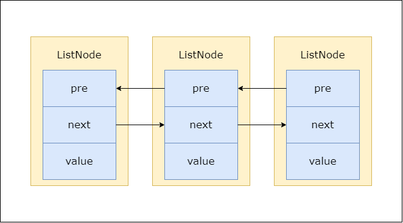
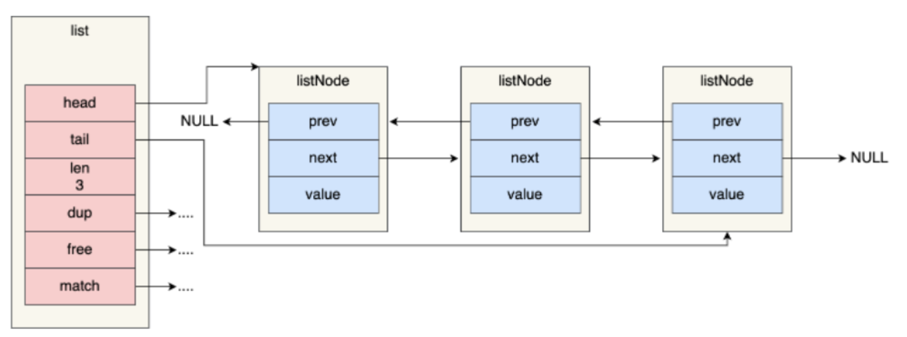

### 📌Chapter3-链表
#### 🔻概要
        🔸C中没有包含链表这种数据结构 Redis就自己实现了一个链表
        
        🔸链表被用在List对象的健、发布订阅、慢查询、监视器等
#### 🔻数据结构
     
🔸链表节点(ListNode)
```java
public class ListNode{
    ListNode pre;
    ListNode next;
    int value;
}
```
        
        🔸链表(List)：List结构来持有ListNode 操作更加方便

```java
public <T> class List{
    ListNode head;//头指针
    ListNode tail;//尾指针
    int len;//链表长度
    void dup(T node){};//复制节点的值
    void free(T node){};//释放节点的值
    int match(T n1,T n2){};//节点值是否相等
}
```


#### 🔻总结
  
  🔸**双端**:有`pre`和`next`指针 获取前驱和后继节点为速度*O(1)*
   
    🔸**无环**:第一个元素的`pre`和最后一个节点的`next`指向`NULL`
   
    🔸获取表头和表尾元素的速度为*O(1)* 因为使用`head`和`tail`节点
   
    🔸获取链表的长度的为*O(1)* 直接获取`len`属性
   
    🔸**多态**:使用`void*`保存节点 通过`dup`、`free`、`match`为节点值设置不同类型的特定函数 就可以保存不同类型的值
#### 🔻泛化
    🔸**空间换取时间**：链表作为底层用空间换取时间让添加和删除操作更加快速

#### 🔻实践
  
  🔸Todo·······