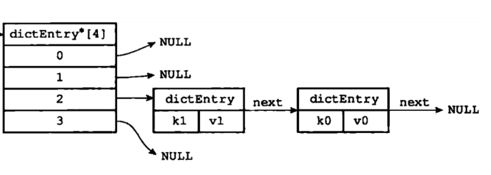
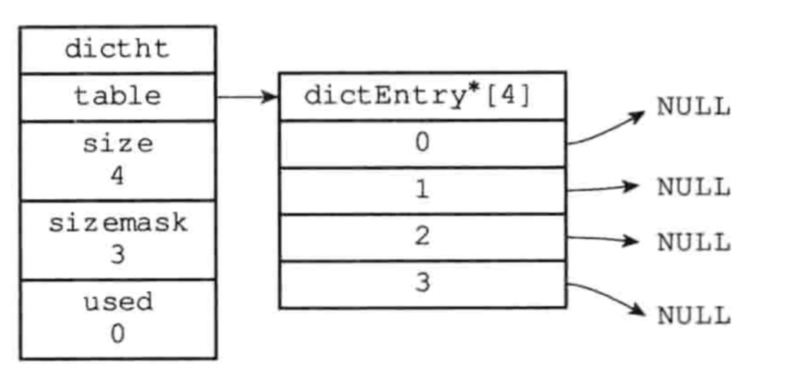
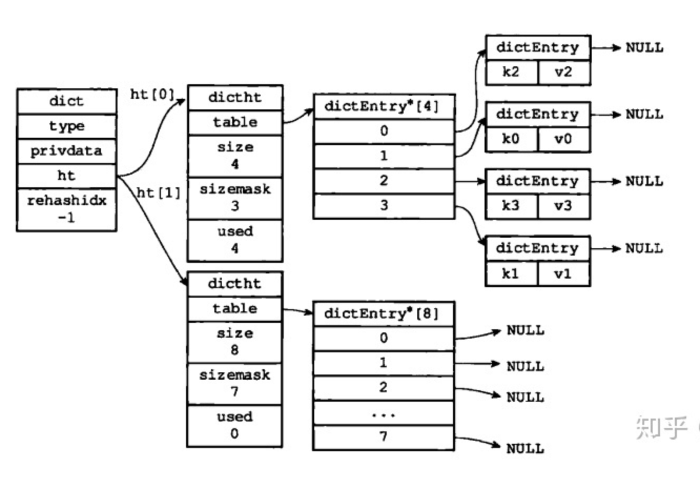

### 📌第4章-字典

#### 🔻概要

        🔸C语言没有实现 字典 Redis构建了自己的字典数据结构
        
        🔸字典被用在**redis的底层实现** 和 **哈希键**
        
        🔸字典又叫映射、符号表 是一种保存 K-V键值对的数据结构 每个key是唯一的

#### 🔻底层数据结构
     
🔸哈希表节点(dictEntry)
```java
public class dictEntry{
	dictEntry next;//使用链地址法解决哈希冲突
	int key;
	int val;
}
```

        
        🔸哈希表(dicht):字典的底层采用哈希表实现

```java
public class dicht{
	dictEntry[] table;
	long size;// table.length
	long used;//已经占用的table
	long maskSize;// table.length-1
}
```

        
️        🔸字典(dict)

```java
public class dict{
	
	dictht[2] ht;//字典有两个哈希表 默认只使用ht[0] 在rehash的时候 ht[1]才被使用

	int rehashIdx;//表示 要去rehash ht[0].table[rehashIdx]上的数据 
							  //记录了rehash的进度 **默认为-1 开始为0**
	dictType type;//针对不同类型的键值对 创建多态字典而设置
    
	void privdata();//针对不同类型的键值对 创建多态字典而设置
	
}
```


#### 🔻哈希算法

      
🔸当一个新的键值对添加到字典时 首先使用`dict.type.hashFunction`函数计算出`key`的哈希值
        
        🔸然后通过与`dict.ht[0/1].maskSize` 做&运算 得出 键值对要存入`dict.ht[0/1].table`的下标
        
        🔸再判断该位置有没有插入元素 没有的话直接插入 有的话就有哈希冲突 用**链地址法➕头插法**解决
        
        ⭐️计算 `dict.ht[0/1].table[idx]  idx = dict.type.hashFunction(key) & dict.ht[0/1].maskSize`

#### 🔻Rehash
     
🔸随着哈希表存入的元素越来越多就容易产生哈希冲突 导致获取元素的效率降低 此时需要扩容
     
      🔸扩容可以通过**rehash**来实现 
        
              🔹**rehash步骤** 
    
              🔹1.`dict`为`dict.ht[1]`分配空间 大小为 **第一个 大于等于 `dict.ht[0].used * 2` 的n次幂**
    
              🔹2.`dict.ht[0]`上的所有的元素重新进行 哈希算法的流程  rehash到`dict.ht[1]`上
    
              🔹3.rehash结束后 将`dict.ht[0]`清空 同时将`dict.ht[0] = dict.ht[1]` 并且`dict.ht[1]`设置为空
   
     🔸哈希表扩容的时机
         
              🔹服务器**没有**执行`BGSAVE`或者`BGREWRITEAOF`时并且哈希表负载因子大于等于1
        
              🔹服务器**在**执行`BGSAVE`或者`BGREWRITEAOF`时并且哈希表负载因子大于等于5

      
💡:*为什么执行持久化的时负载因子比不执行的时候大？*
      
     
       💬:*因为持久化时会产生一个子进程 避免其存在期间 对哈希表扩容操作 进而避免不必要的内存写入节约内存*

#### 🔻渐进式rehash   
  
  🔸如果`dict.ht[0]`的元素非常非常多 此时rehash 将会对服务器的CPU性能造成瓶颈导致宕机
     
    🔸渐进式rehash 不会一次性的把`rehash dict.ht[0]`的所有元素 而是分多次 渐进式的完成rehash
     
        🔹哈希表进行rehash期间 把字典的`rehashIdx`设置为0 在此期间进行的增删改查作都会进行rehash  `ht[0].table[rehashIdx]`的元素`rehash到ht[1]` 然后 `rehashIdx++` 在resh操作结束后 `rehashIdx` 设置为0 
     
        
🔹渐进式rehash的好处在于 使用了**分治**的思想将一次性的`dict.ht[0]` 键的计算分摊到对字典的增删改查的操作上 避免了集中式的rehash给服务器cpu带来的庞大的计算量
   
    🔸在渐进式rehash期间的 添加操作 新添加的键值对都会保存到`dict.ht[1]`中

#### 🔻总结
  
  🔸Redis字典被用在数据库的底层实现和哈希键上
   
    🔸Redis字典使用哈希表作为底层实现 每个字典有两个哈希表 一个平时使用 另一个rehash使用
   
    🔸Redis字典被当作数据库底层或哈希键底层时 使用MurmurHash2的算法计算哈希值
   
    🔸哈希表采用链地址法解决哈希冲突
   
    🔸哈希表进行扩容和收缩的时候 程序需要将哈希表的`ht[0]`的所有元素rehash到`ht[1]`中 同时这个过程不是一次性的而是分多次 渐进式的完成
#### 🔻泛化
    🔸**减量：** 通过rehash能将目标的大容量转移另一个区域从而达到优化时间复杂度低的问题
    
    🔸**分治和捎带并行：** 通过渐进式rehash 将rehash庞大操作**分摊**到每一次的小操作(增删改查) 避免了集中式的rehash给服务器cpu带来的庞大的计算量
#### 🔻实践
  
  🔸······
