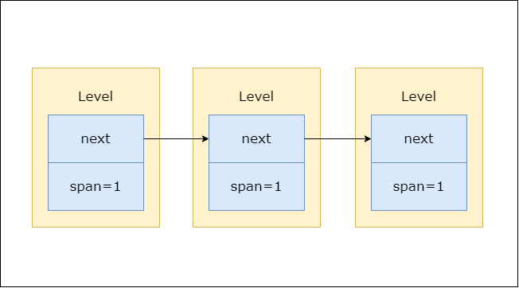
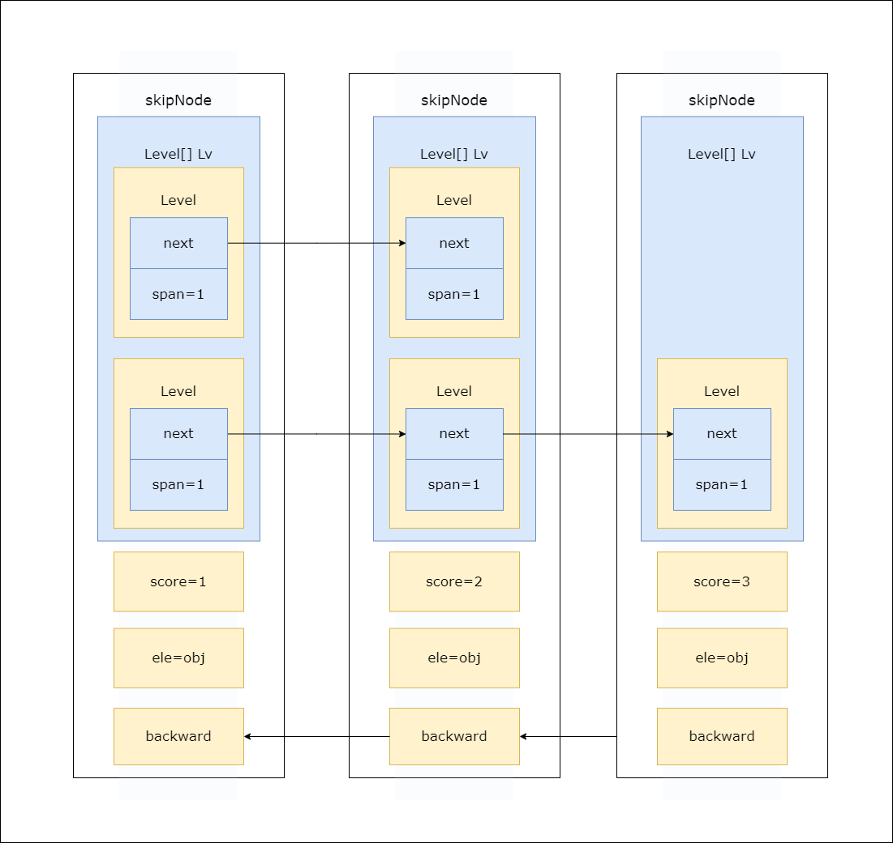

### 📌Chapter5-跳表
#### 🔻概要
        🔸跳表是*有序集合键* 实现的底层数据结构之一 `zset`
        
        🔸跳表的查找效率可以和平衡树媲美 并且比平衡树实现更加简单 平均时间复杂度为`O(logN)` 最坏为`O(N)`
        
        🔸在redis中 跳表被用在 有序集合键`sorted set`和`集群节点`中用作内部数据结构

#### 🔻数据结构
     
🔸层节点
```java
public class Level{ //代表各个层
    Level next;     //指向尾节点的指针 指向同层的下一个节点
    int span;       //前进指针指向节点的 当前节点的距离
}
```


     
🔸跳表节点
```java
public class skipNode{ //跳表节点
    Level[] lv;        //层对象:数组:L1、L2 ····之类的 一般从L5开始 往下查找 初始化时 生成一个1到32大小的数组
    int score;         //节点保存的分值 跳表按照这个分数 进行排序
    Object obj;        //成员对象:各个节点保存的成员对象 zadd key score1 member1(成员) 如果分数一样 成员按照字典序进行排序
    skipNode backward; //和前进指针相反 指向头节点方向的 跳表节点
}
```


     
🔸跳表结构
```java
public class skipList{//跳表结构由多个跳表节点构成
    skipNode head;    //表头指针：指向表头节点的 跳表节点类型 指针
    skipNode tail;    //表尾指针：指向表尾节点的 跳表节点类型 指针
    int length;       //层数 ：记录跳表 层数最大的节点的层数 (表头节点不算)
    int level;        //长度：当前跳跃表存储元素个数 (表头节点不算)
}
```


#### 🔻总结
  
  🔸跳表是实现有序集合键的底层数据结构之一
   
    🔸跳表由跳表节点组成 跳表节点由 层数组 分数 成员对象组成
   
    🔸跳表节点的层高都是1到32的随机数
   
    🔸跳表中可以包含分数一样的节点 但他们的对象必须是唯一的 同时其大小按对象的字典序排序

#### 🔻泛化
    🔸**机制**：····
   
    🔸**机制**：····
#### 🔻实践
  
  🔸Todo·······